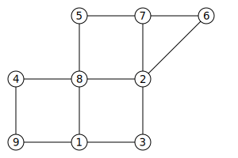

# VertexFinder.jl

[![][travis-img]][travis-url]
[![][coveralls-img]][coveralls-url]

Package author: Jukka Aho (@ahojukka5)

The need to determine pseudoperipheral vertices arises from several
graph-theoretical approaches for ordering sparse matrix equations. This package
implements George-Liu algorithm for finding a pseudoperipheral vertex in a graph
aiming at returning a vertex having a large eccentricity.

## Usage

Let's consider the following graph:



It is easy to see that peripheral vertices for this graph are 9 and 6. The
requirement for the description of the graph is the following: graph must
implement `getindex` and each adjacency list must be iterable. For example, list
of lists or dictionary of lists meets the requirements.

```julia
G = Dict(
    1 => (3, 8, 9),
    2 => (3, 8, 7),
    3 => (1, 2),
    4 => (8, 9),
    5 => (7, 8),
    6 => (2, 7),
    7 => (5, 2, 6),
    8 => (1, 2, 4, 5),
    9 => (1, 4))
```

Starting from node 1:

```julia
w0 = 1
w1 = find(G, w0)
w2 = find(G, w1)
w3 = find(G, w2)
println(w1)
println(w2)
println(w3)

# output

6
9
6
```

## Contributing to project

Any contributions are highly appreciated! If you have some good ideas how to
make this package better, feel free to open an [issue][issue] or send me an
[email][email].

[travis-img]: https://travis-ci.org/ahojukka5/VertexFinder.jl.svg?branch=master
[travis-url]: https://travis-ci.org/ahojukka5/VertexFinder.jl
[coveralls-img]: https://coveralls.io/repos/github/ahojukka5/VertexFinder.jl/badge.svg?branch=master
[coveralls-url]: https://coveralls.io/github/ahojukka5/VertexFinder.jl?branch=master
[issue]: https://travis-ci.org/ahojukka5/VertexFinder/issues
[email]: ahojukka5@gmail.com
